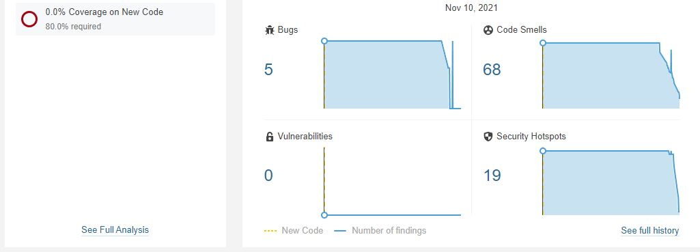
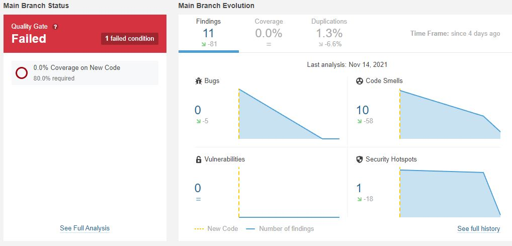

# EboraIT
Laboratorio Ingeniería del Software II

## Descripción del problema 🔨
Las tarea práctica consiste en la realización de un proyecto (durante todo el cuatrimestre) de desarrollo software siguiendo los métodos y técnicas de ingeniería del software vistas en teoría así como aplicando las herramientas que se irán presentando en algunas sesiones de prácticas.

## Resolución del problema 🔨
 
Hemos considerado en dividir el problema en las 3 capas habituales utilizadas en un proyecto.
* **[Dominio](./GSNS/src/main/java/com/eborait/gsns/dominio)** , esta la hemos utilizado para dividir también en dos paquetes:
	* **[Controller](./GSNS/src/main/java/com/eborait/gsns/dominio/controller)**, en controller tendremos los gestores los cuales más tarde se encargaran de llamar a las clases DAO. Estos comunmente harán referencias a insetar,mostrar o actualizar datos.
	* **[Entitymodel](./GSNS/src/main/java/com/eborait/gsns/dominio/entitymodel)**, en este paquete estarán las clases con sus metodos getters y setter así como los toString de cada una de ellas. 
* **[Persistencia](./GSNS/src/main/java/com/eborait/gsns/persistencia)** , en esta capa tendremos mayormente las clases DAO de Entrega,LoteVacunas y VacunacionDAO, tendremos también las clase DAOFactory la cual se usará para crear los objetos DAO siguiendo el patron singleton. También tendremos la clase BDConstantes en la cual vamos a tener todos los datos para instanciar nuestra BD. Y por último implementamos en este paquete la clase AbstractEntityDAO en la que definimos los métodos para implementar en los DAO.
* **[Persistencia](./GSNS/src/main/java/com/eborait/gsns/presentacion)** , en esta última capa tendremos las vistas en forma de JPanel para la parte gráfica de nuestro proyecto.

También hacemos referencia al [POM](./GSNS/pom.xml), en el cual hemos declarado y utilizado las dependencias de junit y de apache.derby esta última para utilizar una Base de Datos embebida. Además de los plugins de Maven. También destacar que este fichero lo hemos utilizado a cada version, por lo tanto para el versionado de la aplicación. 

Por último también hacemos referencia al [Diagrama de clases de diseño](./Diagrama%20de%20clases%20de%20diseño.png)  en UML.

## Planificación y Gestión 📆

Para desarrollar dicho problema hemos ido desarrollando una metodología ágil, también con ayuda de projects de Github hemos podido ir creando tickets con tareas las cuales hemos ido resolviendo, el tipo de projects utilizado es Kanban. Teniamos 3 columnas las cuales eran:
* **To do** , aquí situamos las tareas o progresos que teniamos plantado hacer.
* **In progress**, aquí situamos las tareas o progresos que estamos haciendo en ese momento.
* **Done**, y por último aquí estarán las tareas ya completadas.

Todo esto utilizado como Product Backlog del cúal luego hemos ido seleccionando historias de usuarios para realizar los Sprint Backlog durante el proyecto.
El enlace para visitar nuestro project sería [Product Backlog](https://github.com/escolanojorge/eborait/projects/2)

Además durante el desarrollo del problema se han ido realizando reuniones entre los miembros de la empresa para ir poniendo todo a punto y resolver posibles dudas de las que se pedía en el enunciado.

Se fueron realizando reuniones durante el Sprint Backlog para conocer el estado actual del sprint y así como resolver dudas que nos surgían. Además de las dayly scrum para una visión general de lo que realizamos cada día. La mayoria de las reuniones las hemo ido haciendo en Micrososft Teams.

Durante el periodo de gestionar la calidad también tuvimos una primera reunión el Miércoles 10/11/2021 para planificar nuestro Sprint Backlog el cúal quedaría definido y repartido en arreglar bugs, code smells , security hostpots y código duplicado.

## Gestión de Calidad 🔨

Para la Gestión de Calidad hemos utilizado el SonarCloud, en el cúal nuestro proyecto actual le tuvimos que incorporar a una organización de github para poder trabajar de mejor forma en SonarCloud. Una vez realizado esto ya solo tuvimos que analizar nuestro proyecto en este software para comprobar nuestra calidad del código.

Al principio utilizamos la forma de analizar manualmente , lo que haciamos era una vez realizabamos los cambios en nuestro repositorio en Eclipse, ejecutavamos la acción de maven:
	
	mvn verify sonar:sonar
	
En el primer análisis nos salió que teniamos:

	- 5 Bugs
	- 68 Code Smells
	- 19 Security Hotspots
	- 0 Vulnerabilities
	- 2,1K Lines of Code
	- 7,9% Duplications

La forma en la que realizamos la correción de estas carencias de calidad fué a través del Sprint Backlog repartirnos tareas para corregir ciertos aspectos del código y bajar esas cifras.

Ademaás destacar que decidimos que los cambios para corregir Bugs y Security Hotspots los realizamos en la rama Hotfix, la cúal la ibamos haciendo un merge con Develop, y en los cambios para Code Smells los ibamos realizando en la branch Develop.

Una vez comprobado que funcionaba la forma manualmente ejecutando la sentencia maven, decidimos implementar la Integración Continua que es posible realizar entre sonarcloud y Github, para realizar esto tuvimos que añadir una variable Secret junto a su token en nuestro proyecto de Github, y después tuvimos que crear el archivo localizado en .github/workflows/ llamado [build.yml](/https://github.com/EboraIT/gsns/blob/master/.github/workflows/build.yml)

	name: Build
	on:
	  push:
 	   branches:
      - Development
	  pull_request:
	    types: [opened, synchronize, reopened]
	jobs:
 	 build:
 	   name: Build
    runs-on: ubuntu-latest
    steps:
      - uses: actions/checkout@v2
        with:
          fetch-depth: 0  # Shallow clones should be disabled for a better relevancy of analysis
      - name: Set up JDK 11
        uses: actions/setup-java@v1
        with:
          java-version: 11
      - name: Cache SonarCloud packages
        uses: actions/cache@v1
        with:
          path: ~/.sonar/cache
          key: ${{ runner.os }}-sonar
          restore-keys: ${{ runner.os }}-sonar
      - name: Cache Maven packages
        uses: actions/cache@v1
        with:
          path: ~/.m2
          key: ${{ runner.os }}-m2-${{ hashFiles('**/pom.xml') }}
          restore-keys: ${{ runner.os }}-m2
      - name: Build and analyze
        env:
          GITHUB_TOKEN: ${{ secrets.GITHUB_TOKEN }}  # Needed to get PR information, if any
          SONAR_TOKEN: ${{ secrets.SONAR_TOKEN }}
        run: mvn -B -f /home/runner/work/gsns/gsns/GSNS/pom.xml verify org.sonarsource.scanner.maven:sonar-maven-plugin:sonar -Dsonar.host.url=https://sonarcloud.io -Dsonar.organization=eborait -Dsonar.projectKey=com.eborait:gsns

Destacar la última línea la cual hace la llamada a mvn verify sonar:sonar pero en este caso le tenemos que pasar la ruta de nuestro pom, la url de sonar, y el nombre de nuestra organización de sonar entre otras cosas.

Al realizar la Integración continua ahora lo tenemos configurado para que una vez realizemos un push en la rama Develop , esta ejecutará a su vez un actions del proyecto que llamará al archivo anteriormente descrito para realizar el analisis del proyecto.

Actualmente a día 14/11/2021 tenemos la calidad de nuestro código:

	- 0 Bugs
	- 10 Code Smells
	- 1 Security Hotspots
	- 0 Vulnerabilities
	- 1,9 K Lines of Code
	- 1,3 % Duplications
	
## Autores ✒️

_Proyecto creado por_ 
* **Roberto Esteban Olivares** 
* **Jorge Fernandez Escolano** 

## Construido con 🛠️

_Las tecnologías utilizadas para el desarrollo del proyecto son:_

☕Java  
⚙️Maven  
☁️SonarCloud  
